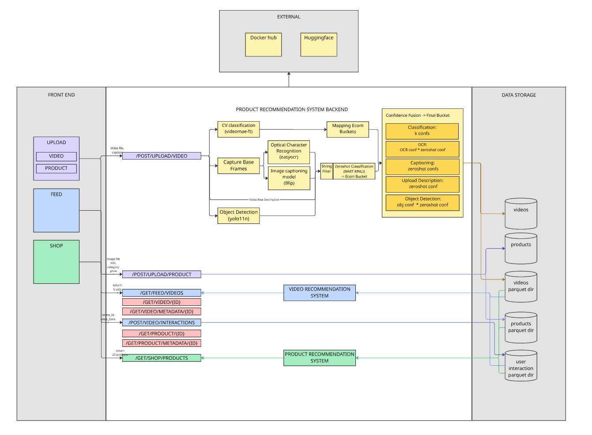
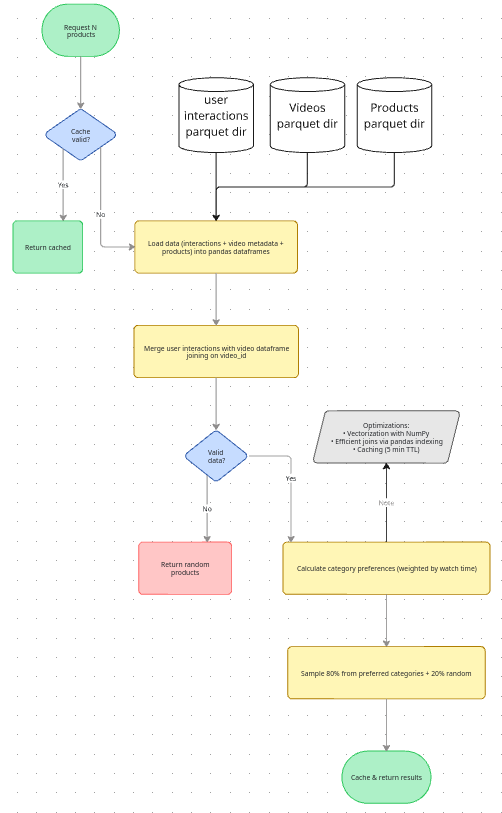
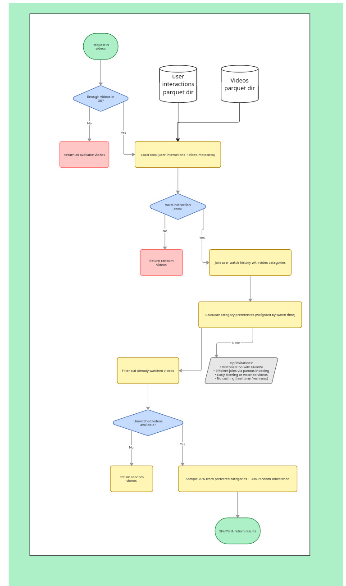
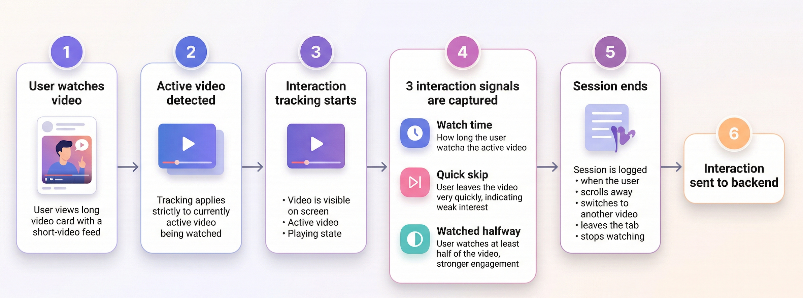
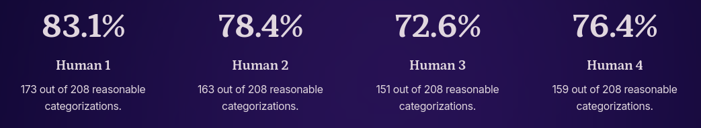

# Social Media Feed and Ecommerce Recommendation

Supakjeera Thanapaisal, Suraj Jayakumar, Bryan Smith, Joel Jacob Stephen

---

## Description

VisCart is a full stack application that demonstrates an end-to-end multi-modal social media feed and e-commerce recommendation system.

We use computer vision to integrate short-form video content with personalized product recommendations through a number of modalities including visual features, textual signal, and semantic descriptions.

## Please Refer To Viscart.pdf for more details

## How to Run

### Required Data
Final data links

Sample_data: 20 products, 20 tiktoks
https://drive.google.com/file/d/1i5IVaPVO0WI28-bTrqtkZ1OYOnush7kT/view?usp=sharing

data: 1000 products, 1000 tiktoks
https://drive.google.com/file/d/1tj35rxMzVQjffsjqzeu65GilU3414cMl/view?usp=sharing

Place files in the workspace folders mentioned below:

Product data
- ```cv-social-media-ecom-recommendation/data/products``` - product images
- ```cv-social-media-ecom-recommendation/data/products_parquet``` - parquet files

Videos
- ```cv-social-media-ecom-recommendation/data/videos``` - video files
- ```cv-social-media-ecom-recommendation/data/video_parquet``` - parquet files

The corresponding parquet files for either products or videos can be generated using
- ```cv-social-media-ecom-recommendation/scripts/preprocess_products.py```
- ```cv-social-media-ecom-recommendation/scripts/preprocess_videos.py```

### Full stack - Docker Compose

```cd cv-social-media-ecom-recommendation```<br>
```docker compose up --build```<br>
- Backend API - http://127.0.0.1:8000/docs
- Frontend App - http://127.0.0.1:3000

## Architecture



Product recommendation


Video recommendation


## Data and Preprocessing

### Videos

Source: [UGC-VideoCap TikToks](https://huggingface.co/datasets/openinterx/UGC-VideoCap)

Database: 1000 samples (full dataset)

Test Data: 20 samples (random)

Preprocessing script: ```/data_processing/preprocess_videos.py```
1. Extract video metadata
2. Categorize with videomae-small-finetuned-kinetics
3. Generate parquet file and save to folder

### Products

Source: [Amazon Berkeley Objects (ABO) Dataset](https://amazon-berkeley-objects.s3.amazonaws.com/index.html)

Database: ~200 hand selected products, 10/category

Test Data: 20 products, 2/category

Preprocessing script: ```/data_processing/preprocess_products.py```
1. Extract metadata from product JSON
2. Discard known bad products
3. Predict category by keywords
   1. ```--interactive``` Manually verify or retag category 
4. Assemble parquet file and save product image to folder

### Evaluation

Source: Curated YouTube Shorts

Samples: 200 manually scraped videos

Samples were manually labeled according to the 10 categories

## Video Categorization

The system combines multiple signals from video classification, object extraction, OCR, captions, and user descriptions.

Models
- Classification: MCG-NJU/videomae-small-finetuned-kinetics
- OCR: EasyOCR
- Object Detection: YOLO11n
- Captioning: Salesforce/blip-image-captioning-base
- Zeroshot Classification: facebook/bart-large-mnli

Categories
1. Fashion
2. Beauty
3. Electronics
4. Home
5. Fitness
6. Food
7. Baby
8. Automotive
9. Pets
10. Gaming

Confidence fusion combines multiple signals into a unified score while reducing noise.

## User Interaction

User interactions with videos are measured with watch time, quick skip, and halfway checks. These signals track user engagement and are used to fine tune the backend classification and personalize recommendations of videos and products.



## Recommendation System

Recommendation system delivers both video and product recommendations according to a number of signals, engagement scoring, bucket-based weighting, preferred + exploratory mix, other category distribution, and duplicate exclusion

1. Engagement scoring: quick skips are penalized and videos watched past half are rewarded
2. Bucket-based weighing: aggregate user watch time by category to weigh recommendations
3. Preferred + exploratory mix: 80% product recs from preferred categories, 70% videos, the remainder are random
4. Other category distribution: equally distribute watch time from other category videos over all categories
5. Duplicate exclusion: removes already watched videos from recommendation feed

## User Study

To verify the results of our video classification system each member of the team watched and labeled the 208 videos according to our 10 categories which we then compare to the output of the models.



Overall average: 77.6% agreement with the video classification model based on real world data.

Misclassifications can be attributed to ambiguous videos that fit multiple or none of the categories, noisy video content leading to model confusion, and object detection that focuses on the incorrect objects.

With only 5 signals we're able to achieve a high level of confidence for our video classification system that we believe matches user expectations.


